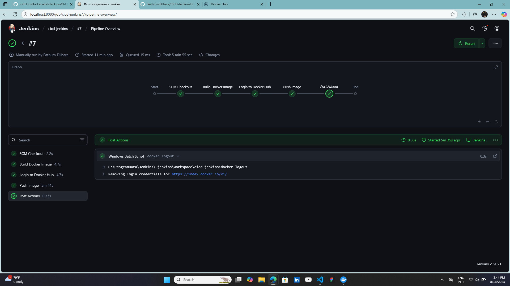
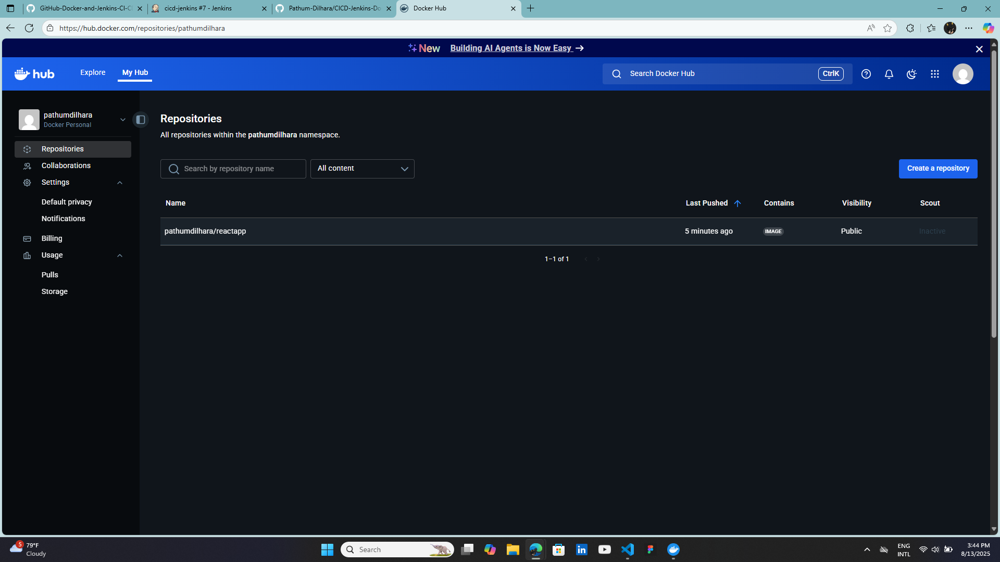
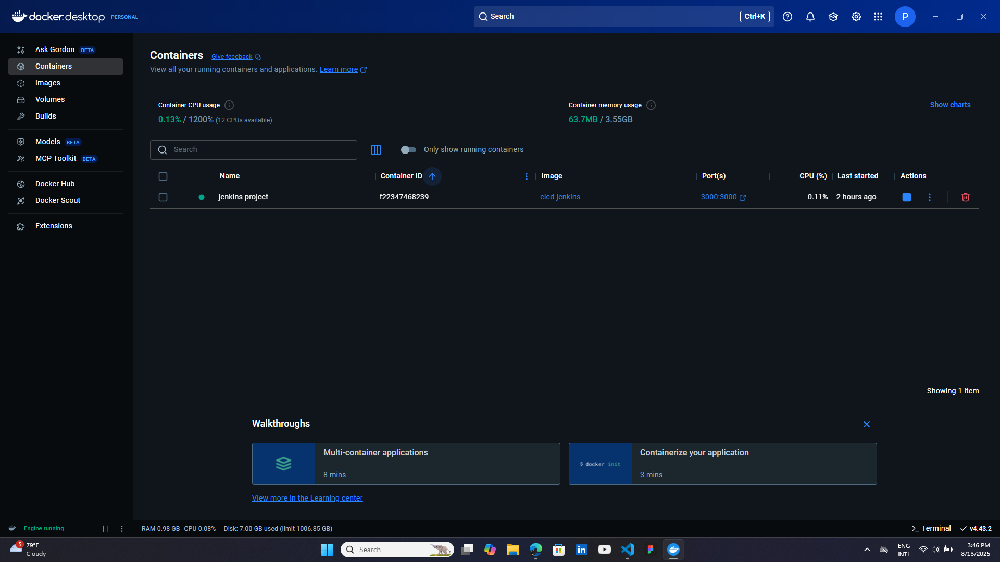

# 🚀 CI/CD Pipeline with Docker and Jenkins

This repository contains code for setting up a Continuous Integration/Continuous Deployment (CI/CD) pipeline using Docker and Jenkins. The pipeline automates the process of building, testing, and deploying applications, ensuring efficiency and consistency in software development workflows.

## 📕 Overview

The CI/CD pipeline involves the following steps:

 - GitHub Push: The process begins when code changes are pushed to the GitHub repository.
 - Jenkins Build Trigger: Jenkins, our automation server, is configured to monitor the GitHub repository for changes. Upon detecting a new commit, Jenkins triggers the build process.
 - Docker Image Creation: Jenkins pulls the base Docker image from DockerHub and builds a Docker image containing the application and its dependencies.
 - Docker Image Push: Once the Docker image is built successfully, Jenkins pushes the image to DockerHub, making it available for deployment.
 - Update Status: Jenkins updates the build status on GitHub, providing visibility into the CI/CD process.
 - Notification: Users are notified of the build status through GitHub notifications.

## 💠 Project

 - Pipeline

- Jenkins

- Docker Hub

- Docker Container

